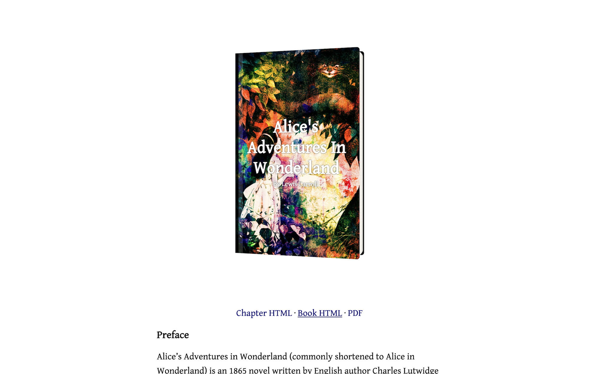

# Author

Book publishing template for Jekyll. Browse through a [live demo](https://petite-spider.cloudvent.net/).

Author was made by [CloudCannon](https://cloudcannon.com/), the Cloud CMS for Jekyll.
Find more templates and themes at [CloudCannon Academy](https://learn.cloudcannon.com/jekyll-templates/).

Learn Jekyll with step-by-step tutorials and videos at [CloudCannon Academy](https://learn.cloudcannon.com/).

## Features

* Chapter-by-chapter view
* Full book view
* PDF view

## Setup

1. Add your site and book details in `_config.yml`.
2. Add your cover details to `_data/settings.yml`
3. Get a workflow going to see your site's output (with [CloudCannon](https://app.cloudcannon.com/) or Jekyll locally).

## Develop

Author was built with [Jekyll](https://jekyllrb.com/) version 3.7.2, but should support newer versions as well.

Install the dependencies with [Bundler](https://bundler.io/):

~~~bash
$ bundle install
~~~

Run `jekyll` commands through Bundler to ensure you're using the right versions:

~~~bash
$ bundle exec jekyll serve
~~~

## Editing

Author is already optimised for adding, updating and removing chapters in CloudCannon.
